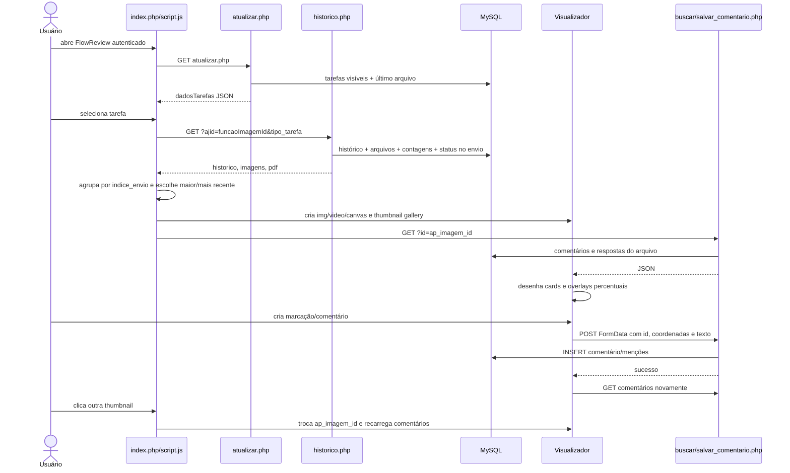
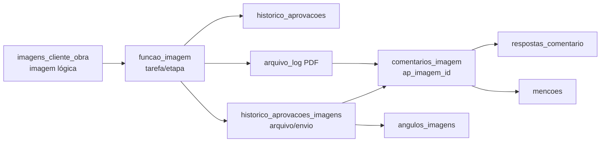

# Análise técnica — FlowReview: imagens, mídias e comentários

Data da análise: 2026-07-13. Escopo exclusivamente de leitura: nenhum fluxo, dado ou esquema foi alterado. A interface autenticada foi aberta em `https://improov/ImproovWeb/FlowReview/`; a tela carregou. Não foram acionados uploads, decisões, exclusões ou gravações.

## 1. Resumo executivo

O FlowReview é uma SPA parcial em PHP/JavaScript: `index.php` entrega o shell autenticado e `script.js` busca a fila de tarefas em `atualizar.php`. Ao abrir uma tarefa, `historyAJAX()` busca `historico.php`, que devolve o contexto da função e todos os arquivos de aprovação (`historico_aprovacoes_imagens`). Estes arquivos são agrupados por `indice_envio`; o envio mais recente é aberto, os demais viram thumbnails.

Para imagem raster, a visualização principal é um `` dentro de `#image_wrapper`; thumbnails são geradas sob demanda por `thumb.php`. Há também suporte integrado a vídeo (`<video>`, poster e instante em ms) e PDF (PDF.js/canvas e camada de comentários). A imagem completa não é um modal separado: é o painel central da revisão. Existe apenas modal de ampliação para anexo de comentário.

O identificador efetivo do arquivo aberto é `historico_aprovacoes_imagens.id`, chamado de `ap_imagem_id` no JavaScript e em `comentarios_imagem`. Portanto comentários de JPG/vídeo já pertencem a um arquivo/envio específico, não somente à imagem lógica `imagens_cliente_obra`. Esse é o melhor ponto de partida existente para comparação de versões. Porém não há modelo explícito de versão pai/filho nem um par “arquivo anterior”; `indice_envio` agrupa remessas, e vários arquivos podem coexistir em uma mesma remessa.

As marcações são percentuais (0–100) em relação ao elemento visual e sobrevivem a mudança de resolução/proporção. Zoom e pan são globais para uma única `#image_wrapper`; podem ser extraídos para um controlador compartilhado, mas não são hoje um componente reutilizável nem têm sincronização entre duas superfícies.

## 2. Estrutura relevante da pasta `FlowReview`

| Arquivo/grupo | Responsabilidade na análise |
|---|---|
| `index.php` | página autenticada, shell HTML, painéis, modais e dependências do front-end |
| `script.js` (6.366 linhas) | estado global, lista de tarefas, seleção de envio/arquivo, visualizador, comentários, anotações, zoom/pan, decisões |
| `style.css` (5.769 linhas) | layout responsivo e estilos de galeria, visualizador, marcadores e painéis |
| `atualizar.php` | fila de tarefas/imagens permitidas ao usuário e metadados iniciais |
| `historico.php` | contrato central da tarefa aberta: histórico, arquivos de aprovação, status do envio e contagens de comentários |
| `buscar_comentarios.php` e CRUDs de comentário/resposta | leitura e persistência de comentários, menções e anexos |
| `approval_media_schema.php` | compatibilidade de schema para imagem/animação/vídeo; executa DDL em tempo de requisição |
| `upload.php`, `substituir_angulo.php`, `atualizar_angulo.php`, `trocar_angulo.php` | criação/substituição de arquivos e seleção de ângulo; relevantes ao histórico de mídia |
| `revisarTarefa.php` | decisão de aprovação, histórico de processo, integração de entrega e registro de `review_uploads` |
| `mencao_slack_helper.php`, `upload_comentario_vps.php`, `.env`, `vendor/` | notificações Slack e anexo de comentário via SFTP/VPS; Dotenv/phpseclib |

Fora da pasta, fazem parte do caminho: `thumb.php` (miniaturas), `uploadArquivos.php` (principal escritor de `historico_aprovacoes_imagens`), `FlowDrive/visualizar_pdf_log.php` (PDF bruto/download) e `config/session_bootstrap.php` / `conexao.php`.

## 3. Arquivos principais e responsabilidades

| Arquivo:linhas aproximadas | Função/classe | Chamado por | Chama/efeitos |
|---|---|---|---|
| `index.php:1-61` | bootstrap da página | rota `/FlowReview/` | valida sessão, atualiza `logs_usuarios`, carrega sidebar/dados auxiliares |
| `script.js:520-614` | `fetchObrasETarefas()` | `DOMContentLoaded`/filtros | `GET atualizar.php`; popula `dadosTarefas`, cards e filtros |
| `script.js:2480-3050` | `historyAJAX(idfuncao_imagem, tipo_tarefa)` | card/linha de tarefa | marca menções vistas, `GET historico.php`, prepara contexto, envios, galeria e arquivo ativo |
| `script.js:4137-4283` | `mostrarImagemCompleta(src,id)` | seleção automática e thumbnail | recria ``, grava `ap_imagem_id`, chama `renderComments(id)`, instala criação de anotação |
| `script.js:3794-4134` | `carregarPdf`, `renderizarPaginaPdf`, `mostrarPdfCompleto` | `historyAJAX` | PDF.js/canvas, paginação e camada de comentários |
| `script.js:4327-4432` | `mostrarVideoCompleto(src,id,media)` | seleção de vídeo | cria `<video>`, usa poster, armazena instante e chama comentários |
| `script.js:5018-5573` | `renderComments(id)` | troca de mídia/CRUD | busca JSON, constrói cards, pins/formas/SVG e respostas |
| `script.js:4590-4757` | submit do modal de comentário | modal `#comentarioModal` | `POST salvar_comentario.php`, invalida cache PDF e recarrega |
| `script.js:5937-6171` | `applyTransforms`, handlers de zoom/pan/desenho | toolbar, wheel, mouse/pointer | aplica CSS transform e converte coordenadas para percentual |
| `historico.php:203-304` | endpoint de arquivos | `historyAJAX` | lê histórico/arquivos, contagens e ângulos; retorna JSON |
| `buscar_comentarios.php:19-73` | endpoint de comentários | `renderComments` | busca por `ap_imagem_id` ou `arquivo_log_id`, acrescenta respostas |

## 4. Entrada e identificação de contexto

`FlowReview/index.php` não consome parâmetros de URL para pré-selecionar imagem, obra, lote ou entrega. A entrada normal é a lista inicial. `fetchObrasETarefas()` chama `atualizar.php`; cada item traz principalmente `idfuncao_imagem`, `imagem_id`, `imagem_nome`, `idobra`, `nome_obra`, `nomenclatura`, `funcao_id`, `nome_funcao`, `colaborador_id`, `status`, último status/histórico e miniatura recente (`atualizar.php:20-70` e variações por usuário).

O clique de tarefa chama `historyAJAX(t.idfuncao_imagem, getTaskTipo(t))` (`script.js:3185-3191`). Ela mantém:

* `funcaoImagemId`: função da imagem/tarefa aberta;
* `currentFuncaoContext`: contexto retornado em `historico[0]` (imagem lógica, obra, função, colaborador, status e nomenclatura);
* `currentIndiceEnvio`: remessa selecionada;
* `ap_imagem_id`: id do registro de arquivo em `historico_aprovacoes_imagens`, isto é, a mídia hoje aberta;
* `currentMediaMode`, `currentVideoTimeMs` e `pdfViewerState`: modo e mídia atual.

`historico.php?ajid=<idfuncao_imagem>&tipo_tarefa=imagem|animacao` não recebe `imagem_id` diretamente. Resolve-o por joins de `funcao_imagem`/`funcao_animacao`, `imagens_cliente_obra`, `obra`, `status_imagem`, `funcao`, colaboradores e `historico_aprovacoes` (`historico.php:43-145`).

## 5. Carregamento, preview e visualização completa

1. `historyAJAX()` recebe `{historico, imagens, pdf}` (`script.js:2508-2558`).
2. Agrupa `imagens` por `indice_envio`, ordena índices descendentemente e dispara o `change` do maior (`2855-2888`).
3. No envio, ordena arquivos por `data_envio DESC`; abre `maisRecente` (`2920-2955`). Há preferência por PDF se a função for caderno/filtro em aprovação e `historico.php` encontrou `arquivo_log` (`historico.php:184-196`).
4. Para raster: monta URL absoluta `https://improov.com.br/flow/ImproovWeb/${imagem}` e chama `mostrarImagemCompleta`. Ela esvazia o wrapper, cria ``, define largura, carrega comentários e ajusta dimensões (`4137-4184`). Não usa canvas nem biblioteca para JPG/PNG.
5. Para thumbnail de imagem usa `thumb.php?path=<encodeURIComponent(img.imagem)>&w=200&q=85` (`3003-3010`). Sidebar de tarefas usa `w=400&q=85` (`3175-3179`). Não há preload explícito de anterior/próxima ou cache de imagens além do cache HTTP.
6. A URL completa não recebe cache-buster; não há fallback visual nem handler `onerror` para raster. O download tenta `fetch` para Blob e cai para nova aba se CORS falhar (`4462-4500`).

O encaixe de desktop é feito por `ajustarNavSelectAoTamanhoDaImagem()` (`4434-4460`): define `max-height` a partir de viewport/cabeçalho/toolbars e largura automática; em até 1024px deixa a CSS decidir para não estourar a tela. A CSS contém os breakpoints e os painéis recolhíveis; a análise de código não localizou tela cheia nativa (`requestFullscreen`), rotação, atalhos de anterior/próxima ou gesto pinch dedicado.

## 6. Navegação, zoom, pan e interação

Não há botões “anterior/próxima” entre arquivos. A navegação é: trocar `#indiceSelect` (remessa) e clicar em thumbnail. Trocar arquivo executa `mostrarImagemCompleta`/`mostrarVideoCompleto`, limpa o wrapper e chama `renderComments` para o novo `ap_imagem_id`. A troca de tarefa executa todo `historyAJAX`, inclusive título, permissões, galeria e sidebar.

Zoom/pan ficam em globais (`script.js:5937-6171`): `currentZoom`, `currentTranslateX/Y`, `isDragging`, `dragMoved`. Os botões `#btn-mais-zoom`, `#btn-menos-zoom`, `#reset-zoom` e `Ctrl+wheel` alteram escala (mínimo 0,5; passo 0,1). `applyTransforms()` aplica `scale(...) translate(...)` em `#image_wrapper` e contraescala bolhas/badges. Mouse e pointer fazem pan quando ferramenta é `ponto`; durante forma/desenho o mesmo handler calcula a geometria. Não há limite de pan, reset automático na troca de arquivo, rotação nem estado persistido em local/session storage.

O teclado só possui Escape para fechar popup/modais (`5885+`). Há `mousedown`/`mousemove`/`mouseup` e `pointerdown`/`pointermove`/`pointerup`; não há `touchstart/touchmove` ativo para pan/pinch. Isso torna caneta/touch parcialmente suportados para desenhar, mas não equivalentes a navegação móvel por gesto.

## 7. Comentários e marcações

### Modelo e ciclo

* Novo comentário: clique (ponto) ou arraste (retângulo, círculo, livre) calcula percentual; modal Quill/Tribute recebe texto, menções e anexo; o submit envia `FormData` a `salvar_comentario.php` (`4650-4732`).
* Listagem: `renderComments(ap_imagem_id)` faz `GET buscar_comentarios.php?id=<id>`; PDF busca uma vez por `arquivo_log_id` e filtra página localmente (`5018-5052`). O endpoint retorna `ci.*`, nome do responsável e, para cada comentário, sua lista de respostas (`buscar_comentarios.php:31-73`).
* Exibição: cards no painel `.comentarios`, marcadores sobre `#image_wrapper` ou `#pdf_comment_layer`, ordenação devolvida pelo banco. Há progresso concluído/pendente e badge na thumbnail.
* Edição/exclusão: front esconde ações para não-autores, mas os endpoints de comentário não aplicam no SQL filtro por autor. `atualizar_comentario.php` atualiza por `id`; `excluir_comentario.php` apaga por `id` e menções relacionadas. Isto é risco de autorização no servidor.
* Resposta: `responder_comentario.php` inclui `comentario_id`, texto, responsável de sessão e anexo; edição/exclusão de resposta filtram `responsavel = $_SESSION['idcolaborador']` (`atualizar_resposta.php:39-43`, `excluir_resposta.php:21`).
* Conclusão: `marcar_comentario_concluido.php` alterna `concluido`, `concluido_por`, `concluido_em`, devolve totais; requer sessão, mas não estabelece por comentário uma permissão de função.
* Menções: `mencoes` liga comentário ou resposta a `mencionado_id`; criação/edição ressincroniza as linhas. Nova menção pode disparar DM Slack por `mencao_slack_helper.php`.

### Coordenadas e renderização

`x`, `y`, `x2`, `y2` são percentuais do retângulo renderizado (`4198-4200`, `4222-4245`, `6036-6069`). Ponto é uma `
`; retângulo/círculo é `.comment-shape` com `left/top/width/height` em `%`; livre é SVG `viewBox="0 0 100 100"` com `path_data` JSON de pares percentuais (`5261-5366`). Cor vem de `cor`; tipo é `ponto|rect|circle|freehand`. O marker abre popup/realce; clicar o card pode recentrar pan se zoom > 1 (`5403-5506`).

O transform do wrapper inclui imagem e overlays, por isso a geometria acompanha zoom/pan. Só pins e badges recebem contraescala visual; traços/formas escalam com a imagem. Para PDF, coordenadas ficam na página e os pins são inseridos apenas na página atual; vídeo ainda grava `video_time_ms`.

## 8. Endpoints e APIs

| Endpoint | Método/parâmetros | Frontend chamador | Dados/efeitos |
|---|---|---|---|
| `atualizar.php` | GET, sessão | `fetchObrasETarefas` | lista JSON de tarefas permitidas; joins de imagem, obra, função, status, histórico |
| `historico.php` | GET `ajid`, `tipo_tarefa` | `historyAJAX` | `{historico, imagens, pdf}`; arquivos por função, contagem/conclusão/ângulo |
| `buscar_comentarios.php` | GET `id` ou `arquivo_log_id`, opcional `pagina` | `renderComments` | array de comentários com respostas |
| `salvar_comentario.php` | POST multipart: `ap_imagem_id` ou `arquivo_log_id`, coordenadas, tipo, cor, texto, menções, imagem | submit do modal | INSERT em comentário/menções; upload VPS; JSON sucesso/id |
| `atualizar_comentario.php` | POST JSON ou multipart `id,texto,mencionados,imagem` | `updateComment` | UPDATE e substituição de menções |
| `excluir_comentario.php` | POST JSON `id` | `deleteComment` | DELETE de menções/respostas-menções/comentário |
| `responder_comentario.php` | POST JSON ou multipart | `salvarResposta` | INSERT resposta/menções e possível Slack |
| `atualizar_resposta.php`, `excluir_resposta.php` | POST JSON/multipart | `updateReply`, `deleteReply` | UPDATE/DELETE limitado ao autor |
| `marcar_comentario_concluido.php` | POST JSON `comentario_id,concluido` | `toggleCommentConcluido` | altera resolução e retorna totais |
| `buscar_usuarios.php`, `buscar_mencoes.php`, `marcar_mencoes_visto.php` | GET/POST | menções e `historyAJAX` | autocomplete, badge e leitura de menções |
| `revisarTarefa.php` | POST JSON | decisão de aprovação | atualiza status/histórico/entregas e pode gravar `review_uploads` |
| `upload.php`/`../uploadArquivos.php` | POST multipart | modal adicionar ângulos | novos registros de `historico_aprovacoes_imagens` |

Não há WebSocket: todas as atualizações são `fetch`/HTTP. Não há token CSRF aparente nos contratos lidos. Alguns endpoints dependem de sessão; `buscar_comentarios.php`, `atualizar_comentario.php` e `excluir_comentario.php` devem ser revisados quanto a bootstrap/autorização efetiva.

## 9. Tabelas, campos e dados da imagem

| Tabela | Papel/campos relevantes |
|---|---|
| `imagens_cliente_obra` | imagem lógica: `idimagens_cliente_obra`, `obra_id`, `imagem_nome`, `status_id`, tipo/subtipo conforme consultas externas |
| `funcao_imagem` | tarefa por imagem: `idfuncao_imagem`, `imagem_id`, `funcao_id`, `colaborador_id`, `status`, prioridade |
| `historico_aprovacoes` | mudanças/decisões: função, status anterior/novo, responsável, `data_aprovacao`; também variante `funcao_animacao_id` |
| `historico_aprovacoes_imagens` | arquivo de aprovação: `id`, `funcao_imagem_id` ou `funcao_animacao_id`, `imagem`, `caminho_imagem`, `nome_arquivo`, `indice_envio`, `data_envio`, `media_tipo`, `mime_type`, `tamanho`, `duracao_ms`, `poster_path` |
| `comentarios_imagem` | comentário ligado a `ap_imagem_id` (arquivo), ou `arquivo_log_id` + `pagina` (PDF): `numero_comentario,x,y,x2,y2,path_data,tipo,cor,video_time_ms,texto,imagem,responsavel_id,data,concluido*` |
| `respostas_comentario` | `id`, `comentario_id`, `texto`, `responsavel`, `imagem`, `data` |
| `mencoes` | referência a `comentario_id` ou `resposta_id`, `mencionado_id`, visto/estado conforme endpoint |
| `historico_imagens` / `status_imagem` | status que vigorava na data de envio e etapa (ex.: P00/R00) |
| `angulos_imagens` | liga imagem lógica + arquivo de histórico ao estado do ângulo (`liberada`, `sugerida`, motivo, entrega) |
| `arquivo_log` | PDF associado à função, recuperado por `funcao_imagem_id`, `tipo='PDF'` |
| `review_uploads` | `revisarTarefa.php:1282-1291` calcula `MAX(versao)` por `imagem_id` e insere próximo número para uploads de revisão; não é a fonte usada pelo visualizador atual |

Índices observados/criados: `idx_comentarios_imagem_arquivo_log`, `idx_comentarios_imagem_arquivo_log_pagina` (`sql/2026-01-13...`), `idx_comentarios_ap_video_time`, `idx_hai_funcao_animacao(funcao_animacao_id,indice_envio,data_envio)`, `idx_hai_media_tipo` (`approval_media_schema.php:65-110`). Não foi localizado DDL versionado completo de todas as tabelas, então PK/FK/índices históricos não declarados não podem ser afirmados apenas pelo código.

## 10. Histórico e versões existentes

Há três conceitos próximos, mas nenhum é versionamento formal da mesma imagem:

1. `historico_aprovacoes_imagens` preserva múltiplos arquivos por `funcao_imagem_id`; `indice_envio` delimita remessa e `data_envio` ordena. É a trilha mais concreta de versões de mídia.
2. `historico_imagens` permite recuperar o status/etapa vigente no instante de `data_envio`, não o arquivo predecessor (`historico.php:237-274`).
3. `review_uploads.versao` é incrementado em caminho de `revisarTarefa.php`, mas não é lido por `historico.php`/`script.js` para seleção ou exibição.

O sistema permite substituir um arquivo de ângulo no mesmo registro (`substituir_angulo.php:87`) e trocar qual arquivo é ângulo definitivo (`trocar_angulo.php:660-767`). Isso pode destruir a representação de “arquivo originalmente aprovado” se não houver cópia externa. Para comparação geral, não se deve inferir que dois arquivos do mesmo `indice_envio` sejam versões: podem ser ângulos distintos.

## 11. Bibliotecas e dependências

Frontend: Quill 1.3.6 (editor), Tribute.js 5.1.3 (menções), SweetAlert2, Toastify, Font Awesome, Swiper 11 e Tabulator 5.5.0; PDF.js é carregado para o visualizador PDF. Backend Composer: `vlucas/phpdotenv`, `phpseclib/phpseclib` e `u01jmg3/ics-parser` (`composer.json`). Não foi identificada biblioteca dedicada de zoom/imagem, comparação, canvas ou WebSocket.

## 12. Fluxo completo

## 13. Pontos de extensão para comparação de versões

* **Catálogo e seleção:** estender o payload de `historico.php:203-288` com metadados explícitos de versão e relação; no front, após `imagensAgrupadas` em `script.js:2855-3040`, substituir seleção singular por “A/B”.
* **Visualizador duplo:** extrair `mostrarImagemCompleta`, `applyTransforms` e estado global (`4137+`, `5937+`) para instâncias de viewer. Um container A/B permite lado a lado, divisor e sobreposição com opacidade.
* **Sincronização:** centralizar `zoom`, `translateX/Y` em estado normalizado (escala e centro percentual), não pixels. O atual `translate` em px é dependente do wrapper e não pode simplesmente ser copiado se resoluções/containers divergirem.
* **Comentários:** o filtro natural é `comentarios_imagem.ap_imagem_id`; `renderComments` já recebe o arquivo. Adicionar modo “A”, “B”, “ambos” e duas camadas de overlays. Não reutilizar a mesma `.comentarios` sem namespace/isolamento.
* **Correspondência de coordenadas:** `x/y` percentuais permitem mapear diretamente apenas se as duas versões mantiverem o mesmo enquadramento visual; corte, render de outra câmera ou mudança de proporção exige metadados de transformação ou aviso de incompatibilidade.
* **Performance:** manter thumbnails atuais, carregar arquivos A/B sob demanda, usar `img.decode()`/preload controlado e cancelar/ignorar respostas antigas por token/`AbortController`.
* **Permissões e histórico:** aplicar as regras de tarefa/obra em endpoint de comparação; registrar escolha/visualização só se houver requisito futuro. Não depender de verificações de UI/localStorage.

## 14. Limitações, riscos e pontos de atenção

* `script.js` é altamente acoplado e grande; o estado global permite uma mídia por vez. Trocas rápidas não têm `AbortController`/token de requisição, então resposta de comentário atrasada pode redesenhar a mídia já trocada.
* `historyAJAX` mistura busca, permissão, decisões, renderização, navegação e listeners. Clona elementos para remover listeners, sinal de ciclo de vida frágil.
* Não existe `version_id`, `parent_historico_id`, hash/checksum, arquivo predecessor nem semântica de “mesma composição”. `indice_envio` é lote/remessa, não versão individual.
* `substituir_angulo.php` atualiza `historico_aprovacoes_imagens.imagem` no próprio registro, comprometendo rastreabilidade de binário anterior.
* DDL condicional em endpoints (`approval_media_schema.php`, comentários concluídos/formas/PDF) mistura leitura/escrita de schema, oculta falhas com `@` e cria risco de concorrência/permissão/performance.
* Comentário e exclusão de comentário não mostram autorização no servidor equivalente à regra visual de autoria; há risco de alteração indevida se o endpoint for alcançável autenticado.
* URLs absolutas hard-coded para `https://improov.com.br/flow/ImproovWeb/` conflitam com o ambiente local e dificultam proxy/CDN/cache. Caminhos são entregues e interpolados em HTML.
* A criação de `numero_comentario` por `MAX()+1` não é atômica; dois autores simultâneos podem receber número repetido sem transação/índice único.
* Queries de `historico.php` usam interpolação de ids inteiros (cast reduz injeção) e subqueries por arquivo/status; em tarefas com muitos envios e comentários podem ser caras. Busca de respostas é N+1: uma query por comentário.
* Sem `onerror`, fallback, indicação de resolução ou proteção explícita para arquivo raster grande. Não há prefetch, virtualização ou limitação de upload visível neste fluxo.
* Zoom/pan não possuem boundaries e não suportam fullscreen, rotação, pinch ou sincronização. O canvas PDF e o `` têm modelos visuais distintos.
* A UI oculta ações por autoria via `localStorage`, que é estado do cliente e não mecanismo de autorização.

## 15. Dúvidas não respondidas somente pelo código

1. Qual é o DDL real/produção de `historico_aprovacoes_imagens`, incluindo FKs, índices e retenção de arquivos?
2. Em quais fluxos `review_uploads.versao` é consumido e se ele representa a mesma mídia ou upload operacional distinto?
3. Qual regra de negócio define que dois arquivos são versões comparáveis e não ângulos/arquivos diferentes da mesma remessa?
4. Se `imagem`/`caminho_imagem` apontam para armazenamento imutável ou podem ser sobrescritos fora de `substituir_angulo.php`?
5. Quais permissões de obra/função deveriam valer para ler, editar, remover e concluir comentário? O código encontrado não é uniforme.

## 16. Arquivos provavelmente alterados em uma futura implementação

`FlowReview/script.js`, `FlowReview/style.css`, `FlowReview/historico.php`, `FlowReview/index.php`, `FlowReview/buscar_comentarios.php`, `FlowReview/salvar_comentario.php`, `FlowReview/revisarTarefa.php`, `uploadArquivos.php`, possivelmente `FlowReview/substituir_angulo.php` e `FlowReview/approval_media_schema.php`; além de migration nova e possivelmente `thumb.php`/serviço de mídia. O alvo real dependerá de decidir se a comparação usa arquivos existentes, snapshots imutáveis ou novo modelo de versões.

## Informações mínimas para planejar a comparação de versões

1. **Existe conceito de versão?** Parcialmente: vários arquivos de aprovação e `indice_envio`; `review_uploads.versao` existe, mas não dirige o viewer.
2. **Onde está?** Principalmente em `historico_aprovacoes_imagens` (`indice_envio`, `data_envio`, id do arquivo); separadamente em `review_uploads.versao`.
3. **É possível recuperar imagem anterior?** Sim, selecionando registros anteriores de `historico_aprovacoes_imagens` da mesma função, desde que não tenham sido sobrescritos; não há ponte explícita “anterior”.
4. **Comentários estão ligados à imagem lógica ou ao arquivo?** JPG/vídeo: arquivo específico (`comentarios_imagem.ap_imagem_id = historico_aprovacoes_imagens.id`). PDF: `arquivo_log_id` + página.
5. **Marcações usam coordenadas relativas?** Sim: percentuais 0–100, inclusive formas e SVG livre.
6. **Zoom/pan podem ser reutilizados em duas imagens simultâneas?** A matemática pode, mas a implementação não: é estado global de um wrapper e tradução em pixels.
7. **Mudanças de banco prováveis?** Entidade/versionamento imutável, relação predecessor/grupo de comparação, ordem/version number confiável, metadados de dimensão/proporção/hash, índices e possivelmente transformação entre versões.
8. **Mudanças de frontend prováveis?** Seletor A/B, dois viewers ou compositor, divisor/opacity, controlador sincronizado normalizado, camadas e filtros de comentários, tratamento de diferença de proporção e responsividade.
9. **Mudanças de backend prováveis?** Endpoint de versões comparáveis/metadados, autorização consistente, payload de comentários por versão e estratégia para arquivos/imagens otimizadas; correção de concorrência/cancelamento é recomendada.
10. **Maior impedimento técnico:** ausência de vínculo explícito, imutável e semântico entre versões comparáveis. O histórico atual guarda arquivos, mas não informa de forma confiável qual é o predecessor nem se os dois arquivos representam a mesma vista.
