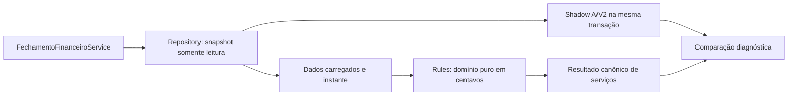

# Pagamento / Adendos — implementação da FASE 1A

**FASE 1A CONCLUÍDA — 02/10/2026.** Motor financeiro canônico de serviços implementado em paralelo, testado e comparável. Podemos seguir para a FASE 1B mediante novo pedido; ela não foi iniciada. Este resultado não constitui automação mensal pronta ou autorização para trocar a fonte financeira da tela.

Referências obrigatórias: [FASE 0](pagamento-adendos-fase0.md), [contrato alvo atualizado](pagamento-adendos-regras-alvo.md), [golden histórica](../tests/characterization/pagamento_adendos_golden.php) e [diagnóstico histórico](../tests/characterization/pagamento_adendos.php). D01–D07 foram formalizadas no contrato antes da implementação do motor. R01–R19 continuam aprovadas, com implementação distribuída entre as etapas.

## 1. Arquitetura criada

O projeto usa serviços PHP em português e `mysqli`, sem framework novo. Foram criadas três responsabilidades: `FechamentoFinanceiroRepository` carrega dados; `FechamentoFinanceiroRules` calcula em memória; `FechamentoFinanceiroService` orquestra colaborador/competência e o snapshot obtido pelo repositório.



O repositório encerra sua transação antes do cálculo em memória. O domínio recebe apenas dados carregados, beneficiário, competência e instante; não consulta SQL, DOM ou um segundo motor. Métodos públicos permitem testar identidade, elegibilidade, comissão, classificação de ledger e saldo diretamente.

A orquestração viva captura uma visão presente do banco. O domínio também aceita dados previamente congelados e seu instante, como nos testes. Não existe consulta histórica arbitrária do banco por um timestamp fornecido: informar uma data antiga sobre dados atuais não reconstrói o passado.

## 2. Arquivos novos

| Arquivo                                                         | Responsabilidade                                                                      |
| --------------------------------------------------------------- | ------------------------------------------------------------------------------------- |
| `Pagamento/services/FechamentoFinanceiroRules.php`              | Regras puras, identidades, centavos, evidências, saldo, pendências e conjunto devido. |
| `Pagamento/services/FechamentoFinanceiroRepository.php`         | SELECTs preparados, candidatos, logs, ledger, legado e transação consistente.         |
| `Pagamento/services/FechamentoFinanceiroService.php`            | Orquestração reutilizável do motor paralelo.                                          |
| `Pagamento/services/FechamentoFinanceiroReadOnlyConnection.php` | Guarda SQL e auditoria em memória usadas por CLI/teste read-only.                     |
| `scripts/diagnostico/ComparacaoFechamentoFinanceiro.php`        | Comparação com A/V2 e projeção documental estática, isolada do domínio.               |
| `scripts/compare_pagamento_financeiro_v1.php`                   | CLI shadow viva ou sobre casos da golden; resultado JSON no stdout.                   |
| `tests/fixtures/pagamento_adendos_financeiro.php`               | Leitura textual da golden e adaptação dos fatos de cada caso.                         |
| `tests/pagamento_adendos_financeiro_v1_test.php`                | Expectativas alvo separadas, sem conexão com banco.                                   |
| `tests/pagamento_adendos_financeiro_v1_readonly_test.php`       | Integração SELECT/transação real, incluindo encerramento e falhas.                    |
| `docs/pagamento-adendos-fase1a.md`                              | Este relatório.                                                                       |

Nenhuma dependência, migration, endpoint financeiro ou UI foi criada.

## 3. Arquivos modificados e alterações concorrentes

Edições desta fase em arquivos existentes:

- `docs/pagamento-adendos-regras-alvo.md`: D01–D07 resolvidas, referências correspondentes e conclusão de autorização da 1A; demais regras aprovadas preservadas.
- `tests/characterization/pagamento_adendos.php`: extração do replay puro de agregação/saldo adaptada ao novo posicionamento desses blocos no controller, sem alterar dados ou expectativas. A seleção de itens continua fora das 1.312 comparações históricas.

**Alteração concorrente identificada:** durante a execução, outra edição modificou `Pagamento/getColaborador.php` e `Pagamento/financeiro_v2.php`. Não foi produzida pela implementação 1A e foi preservada. O diff altera seleção/nome/contadores de parciais e a política de pagamento do legado; esse comportamento não deve ser atribuído ao novo motor. Nenhum desses arquivos foi conectado aos serviços novos.

| Arquivo concorrente            | SHA-256 no início da 1A                                            | SHA-256 observado na comparação final                              |
| ------------------------------ | ------------------------------------------------------------------ | ------------------------------------------------------------------ |
| `Pagamento/getColaborador.php` | `710f76524b8ad7c3ff3729b21bbd7846124cc255ecf45c3fe96f2ab8d7f09026` | `f39fd452d5eda4a6645f941f28a5d4f8d7cecddf625134d187ae8222595306fa` |
| `Pagamento/financeiro_v2.php`  | `aadf783fb5ed53891f6a8405cb704ebc8a0cea608a0dbb15e5e77c0d660a026c` | `f5a7467a9e8bb9fc0adc462e26daaafc5ef77fe6a6fb659a4b29fc75c252fc23` |

O diagnóstico histórico inicialmente interrompeu com “Replay do saldo contém operação não pura”: seu intervalo incluía agora a seleção de itens com `require`. Foi investigado e ajustado para extrair agregação e aplicação de saldo, mantendo os mesmos inputs congelados, exclusão de SQL e os mesmos 1.312 asserts. A golden não foi recapturada.

A edição concorrente de V2 continuou após o shadow, acrescentando uma função de resolução de valor para o writer; hash observado às 13:53:16: `819015eae175c8c82bf5b41a8bf167353c06477cfb43a629626fe1d8ac39d239`. Essa função não é chamada pelo motor 1A ou pela comparação. Os hashes da tabela acima identificam a versão observada na execução documentada, não uma promessa de imobilidade de outras tarefas no workspace.

Hashes conferidos também preservam os arquivos de geração/confirmação, `AdendoLocalService`, PDF, JS de Pagamento, resumo, helper monetário e relatório da FASE 0. Outras alterações preexistentes do workspace permaneceram fora desta implementação.

## 4. Regras implementadas

| Regra   | Implementação 1A                                                                                                                                              |
| ------- | ------------------------------------------------------------------------------------------------------------------------------------------------------------- |
| R01     | FI: status atual elegível + prazo no mês OU qualquer log elegível no mês; início inclusivo/fim exclusivo. Os cinco status e sua normalização são preservados. |
| R02     | Uma transação consistente por leitura; instante/fuso e versão das regras na saída. Não implementa persistência de revisão documental.                         |
| R03/R04 | Identidade `beneficiario_id + origem + origem_id + classe`; um motor novo de domínio para os quatro tipos implementados.                                      |
| R05     | Base persistida ou comissão derivada; ledger compatível de todas as competências; saldo bruto, pendente e excesso. Parcial/completa não apagam saldo.         |
| R06     | Saldo zero permanece analisado, sem serviço financeiro zero. Excesso conserva diagnóstico.                                                                    |
| R07     | Gestor 8, executor 23/40, função 4; Fachada exata sem “embasamento” = 100; demais = 80. Ledger de comissão separado da remuneração.                           |
| R08/D05 | FA usa seu prazo e status; data operacional apenas como evidência de exclusão/contraste. `animacao` legada não vira uma segunda dívida ou pagamento da FA.    |
| R09     | Acompanhamento individual por sua data, com direito e ledger próprios.                                                                                        |
| R13/R14 | Ausência de inputs financeiros da UI; conjunto vazio permanece vazio, sem fallback.                                                                           |
| R15/R19 | Pendências estruturadas e explicação de origem, elegibilidade, base, pagamentos aplicados/ignorados, saldo e exclusão.                                        |

Classes: `REMUNERACAO_TAREFA`, `COMISSAO_GESTOR`, `FUNCAO_ANIMACAO`, `ACOMPANHAMENTO`. Versão explícita: **`pagamento_adendo_financeiro_v1`**.

`custos_tipo` é reutilizado: TAREFA/parcial/complemento reduzem remuneração; COMISSAO reduz comissão; ANIMACAO de `funcao_animacao` reduz FA; ACOMPANHAMENTO reduz acompanhamento. Tipos incompatíveis ficam explicados em `pagamentos_nao_aplicaveis`. Classe desconhecida do mesmo beneficiário/origem/ID gera `CLASSE_LEDGER_NAO_RECONHECIDA`, sem atribuir saldo definitivo.

Não foi introduzida filtragem por status do cabeçalho nem por competência de pagamento. Os IDs, valores, observação, classificação, competência e status observado são conservados. A flag da tarefa do executor não comprova liquidação da comissão do gestor.

Pendências dos direitos elegíveis:

- `PAGAMENTO_SEM_LEDGER`: flag paga sem lançamento compatível; conserva base/flag/ledger observado, mas pago/saldo definitivos ficam `null`.
- `PAGO_ACIMA_DO_DEVIDO`: excesso conhecido bloqueia; ledger e excesso não são alterados.
- `ANIMACAO_LEGADA_AMBIGUA`: exige pagamento legado real observado em origem relevante. Registra a identidade legada e, quando associada, a FA afetada; não soma/converte esses pagamentos. Apenas existir um registro pai em `animacao` não cria divergência.
- `CLASSE_LEDGER_NAO_RECONHECIDA`: exige lançamento real incompatível com a classificação suportada.

Cada pendência contém código, severidade/bloqueio, identidade, valores, evidências e mensagem. Nenhuma decisão ou reconciliação automática é executada.

## 5. Regras explicitamente fora do escopo

Fixo, bônus/extras, rubrica especial de 4.000, total final, overrides, reconciliação mutável, migrations, PDF, preview documental persistido, versões/hash de documento, confirmação, envio, assinatura, lote mensal, scheduler, “Revisar próximo” e UI ficam fora da 1A.

D01–D07 estão decididas: D01/D03 para fixo, D02/D06 para bônus, D04 para atos administrativos, D05 para legado e D07 para revisão enviada/visualizada. Essa aprovação não significa que as implementações 1B/1C já existam.

Nenhum endpoint atual passou a utilizar o motor. `getAdendoItens`, coletor JS, V2, `AdendoLocalService` e fluxo de geração continuam existentes. A CLI compara o legado, mas ele não calcula o resultado canônico nem é chamado como fallback.

## 6. Formato conceitual do resultado

```text
colaborador_id, competencia, snapshot_em, timezone, rule_version
itens_analisados[]
  identidade { beneficiario_id, origem, origem_id, classe }
  descricao, elegibilidade { elegivel, motivo, evidencias }
  valor_original, base_centavos, regra_base
  pagamentos[], pagamentos_nao_aplicaveis[]
  pago_ledger_centavos, pago_centavos
  saldo_bruto_centavos, saldo_centavos, excesso_centavos
  flag_legada_pagamento, flag_refere_a_classe
  situacao, motivo_exclusao, divergencias[]
servicos_devidos[], pendencias[]
subtotal_servicos_centavos, subtotal_servicos_completo, bloqueado
componentes_fora_do_escopo[]
consistencia (quando calculado pelo serviço vivo)
```

Situações: `DEVIDO`, `QUITADO`, `PENDENCIA`, `NAO_ELEGIVEL`, `SEM_VALOR_DEVIDO`. Candidatos carregados apenas para explicar exclusões podem estar fora da competência/status e não entram no subtotal.

`servicos_devidos` contém somente direitos elegíveis, determinados, sem pendência e com saldo positivo. O subtotal é a soma desse conjunto conhecido. **Não equivale a total final do adendo.** Com saldo indeterminado, `subtotal_servicos_completo=false`; subtotal conhecido zero não declara quitação dos itens desconhecidos.

Excesso conhecido pode manter `subtotal_servicos_completo=true` e simultaneamente `bloqueado=true`: a soma está determinada, mas o colaborador exige decisão financeira. Animação legada ambígua torna o subtotal incompleto. Consumidores futuros precisam observar ambos os campos.

Exemplo AC 617: `base_centavos=1000`, `pago_ledger_centavos=0` (quantia observada no ledger), `pago_centavos=null`, `saldo_centavos=null`, situação PENDENCIA. O zero observado não é uma decisão de que nada foi pago.

## 7. Estratégia de snapshot consistente

Ambiente conferido: **MySQL 8.0.46-0ubuntu0.24.04.4**; isolamento padrão observado REPEATABLE-READ. As dez tabelas de leitura são InnoDB: colaborador, funcao_imagem, imagens_cliente_obra, funcao, log_alteracoes, funcao_animacao, animacao, acompanhamento, pagamento_itens e pagamentos.

Sequência adotada:

1. Validar competência/beneficiário e exigir conexão dedicada com autocommit.
2. `SET TRANSACTION ISOLATION LEVEL REPEATABLE READ, READ ONLY`, sem SESSION/GLOBAL, configurando apenas a próxima transação.
3. `mysqli::begin_transaction(MYSQLI_TRANS_START_READ_ONLY | MYSQLI_TRANS_START_WITH_CONSISTENT_SNAPSHOT)`.
4. Obter `UTC_TIMESTAMP(6)`, verificar engines e carregar todas as fontes. A leitura A/V2 da CLI usa a **mesma conexão e transação**.
5. Conferir engines após as leituras e encerrar com `rollback` em `finally`, inclusive em exceções. Calcular fora da transação.

Se o chamador já abriu transação, MySQL rejeita SET TRANSACTION (erro 1568) antes de START; o repositório não confirma ou encerra a transação alheia. Engine ausente/não InnoDB impede a leitura. Nenhuma alteração de isolamento global é executada. A conferência posterior ocorre após as queries adquirirem metadata locks nas tabelas utilizadas.

A visão consistente é estabelecida no início da transação. O timestamp consultado dentro dela identifica essa execução lógica, com microssegundos e conversão para America/Sao_Paulo; não representa uma capacidade de time travel ou o horário individual de cada versão de linha. Cada execução da CLI possui seu próprio snapshot; os 14 pares não formam um fechamento único em lote.

Fundamento: [transações e WITH CONSISTENT SNAPSHOT no MySQL](https://dev.mysql.com/doc/refman/8.4/en/commit.html), [escopo de SET TRANSACTION](https://dev.mysql.com/doc/refman/8.4/en/set-transaction.html), [leituras consistentes InnoDB](https://dev.mysql.com/doc/refman/8.4/en/innodb-consistent-read.html) e [flags de mysqli::begin_transaction](https://www.php.net/manual/en/mysqli.begin-transaction.php). O suporte foi verificado no MySQL 8.0 real, além da consulta à documentação.

Somente SELECT, configuração/início de transação read-only e rollback foram utilizados. A guarda CLI rejeita DML/DDL, multi-query, output de arquivo e locks explícitos antes de execução; é defesa adicional para SQL auditado, não substitui um usuário DB com privilégios mínimos. Não houve tentativas de DML/DDL no banco nem writers concorrentes criados para testar isolamento.

Uma conferência adicional de `information_schema.TABLES` não encontrou nenhuma base table não InnoDB no schema atual, incluindo as tabelas auxiliares lidas pelo legado shadow. A garantia automática do repositório continua restrita às dez fontes canônicas listadas; alterações no conjunto de fontes do shadow exigem nova auditoria.

## 8. Representação monetária

O motor reutiliza `custos_centavos` na borda, preservando o arredondamento existente, e `custos_tipo` para classificar ledger. O helper existente converte entrada numérica para centavos com round; seu uso de float nessa conversão foi mantido deliberadamente para não mudar a regra consolidada. Nenhuma soma/subtração financeira do motor usa float.

Base, pago, saldo bruto, saldo pendente, excesso e subtotal são inteiros. Comissão é 8.000/10.000 centavos. Soma e conversão possuem guardas de intervalo/overflow. `saldo_bruto=base-pago`, `saldo=max(bruto,0)`, `excesso=max(-bruto,0)`; valores desconhecidos são `null`, distintos de zero.

Formatação/decimal pertence à apresentação. Entrada monetária de bônus não foi criada na 1A; sua normalização futura continua regida por D06. Os testes verificam 0,10+0,20=30 centavos, arredondamento compatível e falhas de valores inválidos/overflow.

## 9. Testes e comandos

Validação final com PHP 8.2.12:

| Verificação                                                             | Resultado                                                              |
| ----------------------------------------------------------------------- | ---------------------------------------------------------------------- |
| Lint dos nove arquivos PHP novos e diagnóstico histórico modificado     | 10 arquivos sem erro de sintaxe.                                       |
| `tests/pagamento_adendos_financeiro_v1_test.php`                        | **230 verificações alvo OK**, offline.                                 |
| `tests/pagamento_adendos_financeiro_v1_readonly_test.php --db-readonly` | **14 verificações OK**, conexão real read-only.                        |
| `tests/characterization/pagamento_adendos.php --verify`                 | **1.312 comparações históricas OK**, sem DB/PDF/DOM vivo.              |
| `tests/custos_v2_test.php`                                              | **329 verificações OK**.                                               |
| CLI shadow `--golden`                                                   | 10 casos obrigatórios; 16 diferenças esperadas, zero inesperadas.      |
| CLI shadow viva                                                         | 14 pares; 550 diferenças esperadas, zero inesperadas; exit 0 em todos. |

Os testes alvo cobrem T01/T02/T03/T04/T05/T06/T07/T08/T09/T14/T16/T17/T18/T22, os dez casos obrigatórios reais e FI 117304. Incluem beneficiários/classes independentes, limites do mês, status, ledger entre meses, flag paga sem prova, excesso, legado ambíguo sintético, ausência de parent operacional da FA, identidade duplicada, guardas SQL e vazio. Cenários sintéticos são arrays em memória, não registros inseridos.

A integração verifica flags read-only/consistent, leitura repetida, carga real, timestamp, rollback no sucesso/erro e rejeição de transação preexistente sem encerrá-la. Leitura repetida não é um teste de estresse com mutação concorrente; essa mutação exigiria escrita, proibida nesta fase.

O shadow também é testado com regressões injetadas em memória: base errada, subtotal inconsistente e omissão de serviço devido devem produzir UNEXPECTED_DIFFERENCE.

```powershell
& C:\xampp\php\php.exe tests/pagamento_adendos_financeiro_v1_test.php
& C:\xampp\php\php.exe tests/pagamento_adendos_financeiro_v1_readonly_test.php --db-readonly
& C:\xampp\php\php.exe tests/characterization/pagamento_adendos.php --verify
& C:\xampp\php\php.exe tests/custos_v2_test.php
& C:\xampp\php\php.exe scripts/compare_pagamento_financeiro_v1.php --golden
& C:\xampp\php\php.exe scripts/compare_pagamento_financeiro_v1.php --colaborador=8 --mes=9 --ano=2026
```

`--resumo` reduz detalhes do JSON. Sem ele são expostas identidades, bases, pagos, saldos e diferenças por direito, além de subtotal/pendências. Exit 2 indica diferença inesperada; exit 1 indica erro de execução. A ferramenta escreve apenas no stdout, sem gerar arquivos/documentos. Credenciais são carregadas da configuração local existente, sem serem expostas na saída.

**Testes encontrados e não executados:** `tests/custos_db_integration.php` cria banco/tabelas, insere fixtures e chama writers; executá-lo violaria a proibição explícita de CREATE/ALTER/INSERT/UPDATE nesta fase. `custos_preview.php` é fixture visual; `custos_backup_audit.cjs` é ferramenta de auditoria de dump, sem suíte de asserts do novo motor. Não houve teste de UI/PDF: o motor paralelo não possui tela ou endpoint integrado. A validação de navegador da futura integração permanece obrigatória, conforme seção 15.

## 10. Comparação com a golden histórica

SHA-256 preservado da golden: **`86e743c3d3ff0baf98ad40b74c2403ec3d884c3366d48501dea1f00fce535b20`**. Os 18 casos e expectativas históricas continuam disponíveis. Os testes alvo leem o envelope como texto/JSON, sem executá-lo ou recapturá-lo.

Valores abaixo em reais; cada linha é o recorte real daquele direito, não o subtotal completo do mês:

| Caso / origem                        | Base |  Ledger aplicável | Resultado alvo                                 | Comparação histórica                                                |
| ------------------------------------ | ---: | ----------------: | ---------------------------------------------- | ------------------------------------------------------------------- |
| NORMAL / FI 120437                   |   50 |                 0 | DEVIDO 50                                      | Preservado.                                                         |
| PARCIAL / FI 102804                  |  250 |               125 | DEVIDO 125                                     | Antes excluído no controller/projeção; R05.                         |
| PAGO / FI 110526                     |  380 |               380 | QUITADO, sem serviço                           | Projeção histórica tinha linha zero; R06.                           |
| COMISSAO / FI 120172 / gestor 8      |   80 |                 0 | DEVIDO 80                                      | A já 80; B bruto 300 preservado como evidência incorreta.           |
| COMISSAO_PAGA / FI 118830 / gestor 8 |   80 |                80 | QUITADO                                        | Remuneração 300 do executor não desconta comissão.                  |
| ANIMACAO / FA 534                    |  100 |               100 | Agosto elegível/quitado; setembro não elegível | A/V2 usava data operacional de setembro; R08.                       |
| ACOMPANHAMENTO / AC 617              |   10 | Nenhum compatível | Pago/saldo desconhecidos; PENDENCIA            | Histórico projetava 10; R15, não assumir zero/10.                   |
| DIVERGENCIA / FI 110107              |  150 |               275 | Saldo 0, excesso 125; bloqueado                | Excesso agora estruturado/bloqueante, sem corrigir ledger.          |
| LOG / FI 120385                      |  300 |                 0 | DEVIDO 300 em setembro                         | Qualquer log elegível preservado, apesar do posterior Em andamento. |
| ENTRE_MESES / FI 111524              |  300 |           125+150 | DEVIDO 25                                      | Completa_count histórico eliminava 25; R05.                         |

Caso adicional real FI 117304: comissão Fachada 100, ledger 100, saldo zero, sem serviço. Critério “embasamento” e comparação exata de Fachada preservados em testes separados.

O recorte da golden não contém todas as origens/logs/legados necessários para reconstruir cada mês pelo novo repositório. Ele prova o comportamento dos casos congelados; a comparação viva abaixo usa candidatos completos da execução atual. O banco atual não é tratado como o instante antigo da golden.

## 11. Diferenças deliberadas encontradas e comparação viva

Shadow final executado em 02/10/2026 entre **13:48:15 e 13:48:29 America/Sao_Paulo**, uma transação por par, usando o controller concorrente identificado na seção 3. Valores em centavos:

| Colaborador / competência | Direitos A → elegíveis canônicos | Candidatos analisados | Subtotal documental A → serviços canônicos | Pendências / resultado                                     |
| ------------------------- | -------------------------------: | --------------------: | -----------------------------------------: | ---------------------------------------------------------- |
| 27 / 2026-09              |                          42 → 42 |                    63 |                            205000 → 205000 | Completo, sem bloqueio.                                    |
| 20 / 2025-11              |                          27 → 27 |                    28 |                              80000 → 12500 | 4 PAGAMENTO_SEM_LEDGER; subtotal incompleto.               |
| 6 / 2026-09               |                          32 → 32 |                    36 |                            443000 → 462000 | 12 PAGO_ACIMA_DO_DEVIDO; soma determinada, bloqueado.      |
| 8 / 2026-09               |                          33 → 33 |                    38 |                            912000 → 912000 | Completo, sem bloqueio; linha zero retirada.               |
| 8 / 2026-08               |                          33 → 33 |                    48 |                                      0 → 0 | Completo, sem bloqueio.                                    |
| 13 / 2026-09              |                           13 → 0 |                    25 |                                      0 → 0 | Competência FA por prazo; sem nova dívida.                 |
| 13 / 2026-08              |                          41 → 35 |                    87 |                                      0 → 0 | Competência FA por prazo; quitados não viram serviços.     |
| 1 / 2025-01               |                          84 → 84 |                    84 |                                 241500 → 0 | 82 PAGAMENTO_SEM_LEDGER; saldo desconhecido, não quitação. |
| 1 / 2026-08               |                            0 → 0 |                     0 |                                      0 → 0 | Vazio, sem fallback/fixo/bônus inferido.                   |
| 7 / 2026-08               |                          17 → 17 |                    19 |                                      0 → 0 | Quitados sem linhas zero.                                  |
| 4 / 2026-08               |                          16 → 16 |                    19 |                                      0 → 0 | Completo, sem bloqueio.                                    |
| 33 / 2026-08              |                          16 → 16 |                    22 |                                      0 → 0 | 1 PAGO_ACIMA_DO_DEVIDO; bloqueado.                         |
| 33 / 2026-09              |                          19 → 19 |                    21 |                            380000 → 380000 | Completo, sem bloqueio.                                    |
| 40 / 2026-04              |                            8 → 8 |                     8 |                              10000 → 50000 | Saldos positivos antes excluídos por completa_count.       |

As 550 diferenças são contagens de campos/eventos diagnósticos, não de direitos distintos. Somam retirada de linhas zero, saldos preservados, alteração de competência e abertura de pendências/valores indeterminados. A diferença de subtotal é classificada somente após confrontar as diferenças por direito e conferir a soma dos serviços retornados.

A comparação viva executa o corpo de leitura/cálculo auditado de A e `financeiro_elegiveis` dentro do mesmo snapshot do motor. Não chama o endpoint HTTP ou bootstrap/login. Hashes auditados do controller limitam o `eval` ao código revisado; mudança futura falha e exige nova auditoria. Guarda SQL e transação read-only limitam as operações utilizadas.

A parte documental usa somente `normalizeItensInput/buildRows` via instância sem construtor: projeção estática da aba **A pagar sem filtros**, com data nula conforme coletor analisado. Não executa JS/DOM vivo, PDF ou `gerarAdendo`. Não é autoridade financeira. A mudança 300→80 é demonstrada pela evidência B congelada e teste alvo; a CLI viva não executa B nem apresenta essa mudança como diferença nova de A, que já tinha 80.

## 12. Diferenças inesperadas

**Zero UNEXPECTED_DIFFERENCE** nos dez casos obrigatórios e nos 14 pares vivos finais. Valores de direito acrescentado/removido são expostos, sem comparar uma base inexistente a `null` como se fosse regressão monetária. Cardinalidade/elegibilidade, presença/valor de serviços, subtotais e novas pendências são comparados explicitamente.

A alteração concorrente da seção 3 é diferença de código fora da implementação, não uma diferença financeira mascarada como regra alvo. O erro inicial do diagnóstico histórico foi corrigido na extração do replay; nenhuma expectativa foi reescrita. Os testes de regressão injetada confirmam que base/subtotal/lista devido incorretos continuam sendo denunciados.

## 13. Riscos e limites

- Pendências reais continuam no banco. O novo motor diagnostica, não regulariza ou autoriza o fechamento desses colaboradores.
- Observações livres ainda influenciam `custos_tipo`; tipos sem classificação suportada exigem reconciliação, não soma silenciosa. Não foi criada coluna de classe no banco.
- Repositório usa conexão dedicada, exige InnoDB e termina a transação imediatamente após a carga. O custo de leitura de ledger histórico completo deve ser medido antes de integrar um lote amplo; não houve benchmark de fechamento mensal.
- O guard de CLI não equivale a sandbox SQL genérico. Mudanças no legado auditado/dependências requerem revisão antes de executar o shadow; não remover guardas para fazê-lo passar.
- Testes históricos não validam a seleção SQL atual nem o navegador; o shadow vivo acrescenta a comparação de identidades/elegibilidade, mas sua projeção documental ainda é estática.
- Não houve escrita concorrente de teste, geração de PDF, confirmação, envio ou assinatura. A consistência foi verificada pelo mecanismo suportado e pelos caminhos read-only, não por estresse com writers.
- Dados/instante do motor não são uma revisão documental persistida e imutável. Persistência, hash e atos sobre a versão pertencem à 1C.
- A leitura viva de meses antigos usa o estado atual das origens e ledger; não reconstrói o estado que existia naqueles meses.
- Autorização atual não foi ampliada. Não há endpoint público novo; qualquer consumidor futuro deve aplicar autorização antes de chamar o serviço e restringir a exposição das evidências financeiras.

## 14. Pendências para a FASE 1B

Implementar composição a partir deste subtotal reutilizável, mantendo identidade/evidência para os demais componentes:

1. Fixo aplicável, fonte/override auditável, NULL versus zero e decisão explícita SEM_VALOR_FIXO (D03/D04).
2. Liquidação vinculada a colaborador + competência + direito fixo; legado sem prova = LIQUIDACAO_INDETERMINADA, sem presumir pago zero/total (D01).
3. Extras PENDENTE/SEM_BONUS/DEFINIDO, moeda normalizada no backend e valor positivo; negativo fora do fluxo (D06).
4. PENDENTE_DE_BONUS permite componentes conhecidos, impede total completo/confirmar/enviar e não bloqueia outros colaboradores (D02).
5. Rubrica especial 4.000 separada, rastreável, somada uma vez e preservando os extras manuais aprovados.
6. Composição final somente quando componentes necessários estiverem determinados e as pendências financeiras resolvidas por atos autorizados.

Reconciliação financeira deve preservar histórico, autor, instante, motivo, antes/depois e evidência, sob nível administrativo apropriado (D04). Preview/revisões, confirmação/envio, tokens e assinatura imutável seguem para 1C ou posterior, incluindo D07. Nenhuma dessas implementações começou nesta entrega.

## 15. Critérios para integrar o motor à tela futuramente

O contrato permite seguir para a FASE 1B; **a tela ainda não foi migrada**. A integração futura exige:

1. Compor fixo/extras/especial aprovados sem duplicar as regras de serviços e sem tratar subtotal incompleto como total final.
2. Aplicar autorização atual de preparação/leitura e atos administrativos auditados; não aceitar valores/nomes/lista DOM como fonte financeira.
3. Manter shadow e expectativas alvo/históricas separados; investigar qualquer UNEXPECTED_DIFFERENCE antes de promover a fonte oficial.
4. Apresentar exclusões, valores desconhecidos, bloqueios e evidências, sem liberar documento definitivo de colaborador pendente.
5. Integrar resumo/documento à mesma revisão canônica; implementar persistência/versionamento e confirmação da versão vista antes do fluxo documental definitivo.
6. Validar no navegador interno com login e navegação real pelas URLs oficiais `https://improov/ImproovWeb/` e `http://localhost:8066/ImproovWeb/`, tentando ambas se necessário. Testar abas, filtros, seleção, vazio, pendências e os casos financeiros aprovados.
7. Validar desktop, notebook, iPad landscape/portrait e mobile quando aplicável; verificar UI/PDF em ambiente adequado e autorizado. Se houver loading no Flow, reutilizar Thinking Orbs global conforme AGENTS.md.
8. Só então substituir consumidores do legado e planejar sua remoção. Não usar a conclusão da 1A como autorização para geração/envio em produção ou automação em lote.

Os 20 critérios da 1A estão atendidos no escopo do motor paralelo: identidades e classes separadas, saldo/ledger/centavos, prazo da FA, pendências sem suposição, vazio sem fallback, leitura consistente sem escrita, golden preservada, testes alvo e shadow documentados. Nenhum PDF/adendo/pagamento foi criado pela implementação. **FASE 1A CONCLUÍDA; FASE 1B não iniciada.**
