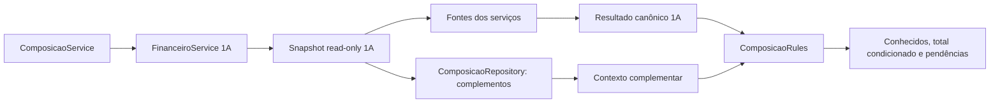

# Pagamento / Adendos — FASE 1B

**FASE 1B CONCLUÍDA — 02/10/2026.** Composição financeira canônica implementada em paralelo, consumindo a 1A. Podemos seguir para a FASE 1C mediante novo pedido; ela não foi iniciada. Nenhum PDF, adendo, pagamento, decisão persistida ou migration foi produzido por esta implementação. O fluxo produtivo continua sem consumir o compositor.

Referências: [FASE 0](pagamento-adendos-fase0.md), [contrato R01–R19/D01–D07](pagamento-adendos-regras-alvo.md), [FASE 1A](pagamento-adendos-fase1a.md), [golden histórica](../tests/characterization/pagamento_adendos_golden.php), [testes alvo 1A](../tests/pagamento_adendos_financeiro_v1_test.php). Expectativas históricas não foram alteradas.

## 1. Arquitetura criada

O domínio foi separado em regras de fixo, extras, configuração da rubrica especial e composição. `FechamentoComposicaoRules::compor(resultado_1a, contexto)` é puro. `FechamentoComposicaoRepository` lê complementos; `FechamentoComposicaoService` orquestra a leitura e a composição. `FechamentoComposicaoSupport` normaliza moeda/metadados nas bordas e constrói pendências.



Não há segundo cálculo dos serviços, segundo snapshot para o fixo, nem SQL no domínio. A transação é encerrada antes do cálculo/composição. Cálculos principais são testáveis sem banco. A saída não é uma revisão documental persistida; congelamento em memória não implementa armazenamento/hash/confirmar da 1C.

## 2. Arquivos novos

| Arquivo                                                   | Responsabilidade                                                                   |
| --------------------------------------------------------- | ---------------------------------------------------------------------------------- |
| `Pagamento/services/FechamentoComposicaoRules.php`        | Consumo do resultado 1A, somatório, total condicionado e propagação de pendências. |
| `Pagamento/services/FechamentoFixoRules.php`              | Configuração, decisão/override, liquidação por evidência e divergências do fixo.   |
| `Pagamento/services/FechamentoExtrasRules.php`            | Estados/decisões de bônus, rubricas, validação e subtotais.                        |
| `Pagamento/services/FechamentoRubricasEspeciais.php`      | Único mapa da rubrica especial R09.                                                |
| `Pagamento/services/FechamentoComposicaoSupport.php`      | Normalização monetária exata, escopo/instante de registros e pendências.           |
| `Pagamento/services/FechamentoComposicaoRepository.php`   | SELECT de cadastro e fatos históricos, dentro da visão 1A.                         |
| `Pagamento/services/FechamentoComposicaoService.php`      | Orquestração paralela, sem efeitos documentais.                                    |
| `scripts/diagnostico/ComparacaoComposicaoFinanceira.php`  | Comparação segura de fatos; sem eval, modal ou geração.                            |
| `scripts/compare_pagamento_composicao_v1.php`             | CLI read-only viva ou diagnóstico dos complementos congelados.                     |
| `tests/fixtures/pagamento_adendos_composicao.php`         | Cenários sintéticos em memória e adaptação dos fatos da golden.                    |
| `tests/pagamento_adendos_composicao_v1_test.php`          | Aceite puro 1B.                                                                    |
| `tests/pagamento_adendos_composicao_v1_readonly_test.php` | Integração real somente leitura.                                                   |
| `docs/pagamento-adendos-fase1b.md`                        | Este relatório.                                                                    |

## 3. Arquivos modificados e concorrência

- `FechamentoFinanceiroService.php`: extensão aditiva `calcularComContexto`, que usa o leitor adicional já existente no repositório. `calcular` mantém seu retorno anterior e delega a essa mesma orquestração. O cálculo de regras 1A continua sendo executado uma única vez.
- `FechamentoFinanceiroRepository.php`: apenas o comentário do leitor adicional foi atualizado para documentar seu uso interno por shadow/1B. Queries, isolamento, regras e encerramento não foram alterados.
- `scripts/diagnostico/ComparacaoFechamentoFinanceiro.php`: controller atual incluído nos hashes auditados após revisão do diff; acrescentada conferência de hash do V2 antes do shadow vivo. Classificação/comparação financeira não foi alterada para esconder resultados.

Nenhuma edição 1B em `Pagamento/index.php`, `script.js`, `getColaborador.php`, `financeiro_v2.php`, `gerar_adendo.php`, `confirmar_adendo.php`, `AdendoLocalService`, helper de Custos, diagnóstico histórico ou golden. Os hashes desses arquivos foram conferidos no início e ao final e permaneceram iguais durante a 1B. O arquivo de regras `FechamentoFinanceiroRules.php` também permaneceu intacto.

O workspace já continha mudanças externas nesses arquivos e em outras áreas, além de um PDF de outra tarefa. Foram preservados, sem atribuir seus efeitos à 1B. Hashes atuais auditados para shadow:

| Fonte                    | SHA-256                                                            |
| ------------------------ | ------------------------------------------------------------------ |
| `getColaborador.php`     | `21661cc051542744e507b15d2b4dcb38cb9388c39d0e57a61e936b9a1cbe4560` |
| `financeiro_v2.php`      | `15d9815e905b379a551c8b97da09637dbc61bb04ae6cdbbf190776d85f72d1c8` |
| `AdendoLocalService.php` | `aba9ad09b2ca9e335a7fd1dcab390dbbbefaaf1e6e8933057f85aa855a1a18bb` |

A revisão do diff identificou a função legada de resolução de tarifa para uma origem zerada com parcela anterior. Ela consulta `funcao_colaborador` e calcula tarifa pelo helper existente; os readers utilizados foram auditados. O motor 1A não passou a usar essa função. Mudanças futuras de hash interrompem o shadow para nova auditoria; não há atualização automática de whitelist.

## 4. Como a 1B consome a 1A

`FechamentoComposicaoService` chama `FechamentoFinanceiroService::calcularComContexto`. Dentro da transação consistente aberta pela 1A, o callback interno lê os complementos. Encerrada a transação, a 1A calcula os serviços e a 1B recebe esse resultado integralmente.

`financeiro_servicos` conserva o array 1A, incluindo versão, itens, ledger, elegibilidade, saldo, subtotal, bloqueio, pendências e consistência. A 1B usa somente o subtotal e os indicadores/pendências para compor e decidir aptidão. Não soma itens novamente, não consulta suas origens, não refaz comissão nem ledger e não acrescenta acompanhamentos individuais uma segunda vez.

Contextos de outro beneficiário/competência ou snapshot distinto são rejeitados. Resultado sem versão canônica reconhecida, centavos inteiros, flags e fuso esperado é rejeitado. Não há fallback ou cálculo a partir de DOM/modal/lista visível.

## 5. Valor fixo

Fonte padrão viva: `colaborador.valor_fixo`, como configuração atual. A saída distingue `configurado_centavos`, `utilizado_centavos`, `pago_centavos`, `saldo_centavos`, `saldo_bruto_centavos`, `excesso_centavos`, `estado_liquidacao`, `origem`, `override`, `decisao` e evidências.

| Estado         | Tratamento                                                                               |
| -------------- | ---------------------------------------------------------------------------------------- |
| DEFINIDO       | Configuração numérica válida ou substituto explícito; zero conhecido permanece zero.     |
| SEM_VALOR_FIXO | Decisão mensal explícita auditável; utilizado zero, conservando a configuração original. |
| NAO_DEFINIDO   | NULL/ausência ou decisão inválida; não vira zero.                                        |

Configuração positiva sem prova de liquidação não é adicionada como saldo conhecido. Valores inválidos/negativos geram pendência, sem desconto implícito. Identidade complementar mensal: beneficiário + competência + classe VALOR_FIXO. Nenhum ID de serviço 1A é reaproveitado para liquidar fixo.

## 6. Liquidação do fixo

Pago só é determinado por evidências internas discriminadas, vinculadas a colaborador + competência + VALOR_FIXO. Registros preservam referência auditável, autor, instante com fuso e valor. Tipos modelados:

- `PAGAMENTO_FIXO`: pagamento positivo explicitamente vinculado ao direito; parcelas válidas somadas em centavos.
- `APURACAO_FIXO_SEM_PAGAMENTO`: apuração financeira explícita de pago zero, com motivo e rastreabilidade. **Não significa uma lista de pagamentos vazia.** Nesta fase só aparece em cenários isolados; o repositório vivo não a cria.

Esse é contrato de dados confiáveis para um futuro adapter autorizado, não uma prova obtida de JSON arbitrário. O adapter deverá verificar origem/existência das evidências e fornecer o conjunto completo aplicável naquele snapshot. O domínio não verifica a existência de um recibo externo ou executa reconciliação.

Sem evidência inequívoca, estado `LIQUIDACAO_INDETERMINADA`, pago/saldo `null`, pendência `FIXO_LIQUIDACAO_INDETERMINADA`. Status pago, valor total agregado, assinatura, payload ou PDF são apenas fatos históricos, nunca convertidos em prova de quitação ou de ausência de pagamento.

Zero utilizado conhecido, sem evidência incompatível, tem `NAO_APLICAVEL_VALOR_ZERO`: obrigação configurada zero, saldo zero. Isso satisfaz o cenário D sem inventar uma liquidação de fixo positivo. Se houver prova de pagamento positivo contra base zero, o excesso bloqueia normalmente.

Escopo errado, classe errada, duplicação, registro futuro, valor inválido ou conflito entre apuração zero e pagamento geram `FIXO_EVIDENCIA_INVALIDA` e liquidação indeterminada. Excesso conhecido gera `FIXO_PAGO_ACIMA_DO_DEVIDO`. `pago_evidenciado_centavos` é apenas soma das evidências válidas observadas, não substitui o pago definitivo quando o conjunto está inválido.

Caso real Anderson/agosto: configurado 4.600, adendo 133 assinado/total 4.600, pagamento agregado existente. Resultado continua pago/saldo desconhecidos; nenhum desses fatos liquida o fixo.

## 7. Override

Modelado no domínio, sem endpoint/storage novo. Conserva original e substituto em centavos, beneficiário, competência, classe, autor, instante, motivo e referência. O original precisa corresponder à configuração carregada; substituto é inteiro não negativo. Override e decisão SEM_VALOR_FIXO simultâneos são conflito.

O substituto troca a base utilizada da composição, preservando o original; não soma duas bases e não modifica `colaborador.valor_fixo`. NULL pode receber valor explícito por override válido. Registro incompleto/incompatível abre `FIXO_OVERRIDE_INVALIDO`, sem uso silencioso do valor.

Autorização administrativa D04 deverá ser aplicada pelo futuro ato/adapter antes de produzir o registro. Os testes usam metadados sintéticos; ter campos autor/motivo não constitui autorização para uma chamada pública. Não há ação mutável de override ou reconciliação nesta entrega.

## 8. Extras / bônus e moeda

| Estado    | Saída                                                                                               |
| --------- | --------------------------------------------------------------------------------------------------- |
| PENDENTE  | Sem decisão; subtotal final dos extras `null`, BONUS_PENDENTE. Ausência de dados também é PENDENTE. |
| SEM_BONUS | Decisão explícita válida, sem rubricas; subtotal zero conhecido e sem pendência.                    |
| DEFINIDO  | Decisão válida e pelo menos uma rubrica positiva; soma das rubricas válidas.                        |

Decisão registrada contém estado, beneficiário/competência/classe, referência, autor, instante e motivo. Cada rubrica contém categoria, valor em centavos, beneficiário, competência, autor, instante e referência própria. Referências duplicadas não são somadas: ambas as ocorrências são inválidas. Metadados inválidos ou rubrica zero/negativa geram EXTRA_INVALIDO; negativo não vira desconto. Estado/lista/decisão conflitantes também bloqueiam.

Se DEFINIDO contém uma rubrica válida e outra inválida, a quantia válida autorizada pode constar de `subtotal_conhecido_centavos`, mas `subtotal_centavos=null` e total final permanece indisponível. Sem decisão válida, os valores observados não entram como bônus autorizado conhecido. Rubricas recebidas e erros são conservados para diagnóstico.

Normalização backend nas bordas, sem biblioteca nova: inteiros em reais, decimais canônicos (`1500.50`), brasileiros (`1500,50`, `1.500,50`, `R$ 1.500,50`) e números JSON usuais. `valor_centavos` explícito precisa ser inteiro; campos valor/centavos simultâneos devem coincidir.

Strings são convertidas por dígitos para centavos, sem multiplicação monetária por float. Número JSON é serializado na borda e imediatamente normalizado. Não são aceitos exponenciais, agrupamentos inválidos, mais de duas casas decimais ou o ambíguo `1.500` sem indicação brasileira; `R$ 1.500` é 1500 reais. Não há arredondamento implícito nessa nova entrada de moeda. O arredondamento do helper e das regras 1A permaneceu intocado. `somar`/`saldo` e proteções de overflow da 1A são reutilizados.

## 9. Acompanhamento especial

`FechamentoRubricasEspeciais` centraliza um mapa de configuração de domínio: beneficiário 1 → ACOMPANHAMENTO_ESPECIAL, **400000 centavos**, regra `R09_NICOLLE_ID1_4000`, origem `CONTRATO_PAGAMENTO_ADENDOS_R09`, versão `rubricas_especiais_r09_v1`.

É separado de fixo, extras e acompanhamentos individuais. SEM_BONUS não o remove, e bônus definido não é substituído. Nenhuma tarifa foi espalhada entre rules/service/repository; mudanças futuras exigem alteração explícita desse único mapa/versão e nova validação do contrato.

## 10. Composição e resultado

Versão: **`pagamento_adendo_composicao_v1`**, conservando `servicos_rule_version=pagamento_adendo_financeiro_v1`.

```text
colaborador_id, competencia, snapshot_em, timezone, rule_version
financeiro_servicos { resultado integral 1A }
fixo { estado, configurado, utilizado, pago, saldo, liquidação, origem,
       override, decisão, evidências, pendências }
acompanhamento_especial { aplicavel, beneficiario, tipo, valor, regra, origem }
extras { estado, decisão, itens, inválidos, subtotal conhecido, subtotal, pendências }
componentes { SERVICOS, VALOR_FIXO, ACOMPANHAMENTO_ESPECIAL, BONUS_EXTRAS }
componentes_indeterminados[]
componentes_conhecidos_centavos
total_final_centavos, total_final_determinado
pendencias[], bloqueado, situacao
persistencia (serviço vivo)
```

Fórmula: subtotal canônico 1A + saldo fixo determinado + especial + extras determinados. Os acompanhamentos individuais já fazem parte do primeiro termo. Todos os somatórios são inteiros, com falha fechada em overflow; nenhuma conversão para apresentação define saldo.

## 11. Componentes conhecidos versus total final

`componentes_conhecidos_centavos` soma as parcelas determinadas disponíveis, incluindo subtotal conhecido de serviços e extras válidos autorizados. Componentes indeterminados continuam `null` em seus campos, sem serem declarados zero.

`total_final_centavos` só existe quando todos os componentes obrigatórios estão determinados e não há bloqueio financeiro. Resultado 1A bloqueado, mesmo com subtotal completo, não libera total final. Excesso pode ter todas as quantias conhecidas e ainda impedir o total apto ao fechamento.

| Cenário isolado aprovado                                                                              | Conhecidos / final                                   |
| ----------------------------------------------------------------------------------------------------- | ---------------------------------------------------- |
| A: serviços 2000 + saldo fixo explicitamente apurado 1500 + SEM_BONUS                                 | Conhecidos/final 3500, determinado.                  |
| B: mesmos serviços/fixo + PENDENTE                                                                    | Conhecidos 3500; final null, BONUS_PENDENTE.         |
| C: fixo NULL                                                                                          | FIXO_NAO_DEFINIDO; final null.                       |
| D: fixo zero conhecido + SEM_BONUS                                                                    | Final 2000, determinado.                             |
| E: Nicolle limpo, serviços 2415 incluindo individuais + fixo apurado 3000 + especial 4000 + bônus 500 | Final 9915; individuais contados uma vez.            |
| F: serviços conhecidos 500 com AC indeterminado + fixo apurado 1000 + SEM_BONUS                       | Conhecidos 1500, final null, bloqueio 1A conservado. |

Os fixos apurados dos cenários A/B/E/F têm evidência explícita **em memória**. Apenas cadastrar 1500, sem essa prova, produziria liquidação indeterminada e não conhecidos 3500. O cenário E não usa Nicolle histórica como fixture limpo: AC 617 real permanece inconsistente no teste próprio.

## 12. Pendências e situação individual

Códigos principais: FIXO_NAO_DEFINIDO, FIXO_LIQUIDACAO_INDETERMINADA, BONUS_PENDENTE, EXTRA_INVALIDO. Adicionais: FIXO_INVALIDO, FIXO_OVERRIDE_INVALIDO, FIXO_EVIDENCIA_INVALIDA, FIXO_PAGO_ACIMA_DO_DEVIDO, BONUS_DECISAO_INVALIDA e SERVICOS_1A_PENDENTES quando flags 1A indicam problema sem uma pendência detalhada.

Pendências 1B contêm código, severidade/bloqueante, componente, identidade mensal, valores conhecidos, evidências e mensagem. Pendências 1A são conservadas sem reescrever seus campos. Nenhum excesso, flag ou pendência é resolvido automaticamente.

Situação resumida: PRONTO, DIVERGENCIA_FINANCEIRA (origem 1A), PENDENTE_FIXO, PENDENTE_BONUS ou PENDENTE_EXTRAS. A lista completa conserva todos os motivos simultâneos; a situação resumida não apaga outros problemas. Cada execução é autocontida; pendência de um colaborador não contamina outro. Lote não foi implementado.

## 13. Testes e regressão

| Verificação                | Resultado                                                       |
| -------------------------- | --------------------------------------------------------------- |
| Lint                       | 17 arquivos PHP verificados, sem erro de sintaxe.               |
| Testes puros 1B            | **169 verificações OK**.                                        |
| Integração read-only 1B    | **26 verificações OK**.                                         |
| Testes alvo 1A             | **230 verificações OK**.                                        |
| Integração read-only 1A    | **14 verificações OK**.                                         |
| Replay histórico           | **1.312 comparações OK**, sem recaptura.                        |
| Custos                     | **329 verificações OK**.                                        |
| Shadow 1A golden / vivo    | 10 casos / 14 pares; zero diferenças inesperadas.               |
| Shadow 1B congelado / vivo | 3 casos de complementos / 5 pares; zero diferenças inesperadas. |

Cobertura T10/T11/T12/T13/T15 e A–F, zero/NULL/SEM_VALOR_FIXO, liquidação positiva total/parcial, ausência e evidência errada, conflito/duplicação, excesso, override e metadados, bônus/decisões/rubricas inválidos, moeda brasileira/exatidão/overflow, snapshot misturado, propagação de pendência real AC 617 e independência individual. O diagnóstico também é testado com adulterações em memória que precisam gerar UNEXPECTED_DIFFERENCE.

Os 26 testes reais verificam que serviços e complementos têm o mesmo instante, usam uma transação, terminam com rollback, mantêm ausência de decisão como PENDENTE, conservam liquidação indeterminada ou zero conhecido e tratam erro de colaborador inexistente. Nenhum writer é executado.

```powershell
& C:\xampp\php\php.exe tests/pagamento_adendos_composicao_v1_test.php
& C:\xampp\php\php.exe tests/pagamento_adendos_composicao_v1_readonly_test.php --db-readonly
& C:\xampp\php\php.exe tests/pagamento_adendos_financeiro_v1_test.php
& C:\xampp\php\php.exe tests/pagamento_adendos_financeiro_v1_readonly_test.php --db-readonly
& C:\xampp\php\php.exe tests/characterization/pagamento_adendos.php --verify
& C:\xampp\php\php.exe tests/custos_v2_test.php
& C:\xampp\php\php.exe scripts/compare_pagamento_composicao_v1.php --golden
& C:\xampp\php\php.exe scripts/compare_pagamento_composicao_v1.php --colaborador=7 --mes=8 --ano=2026 --resumo
```

`custos_db_integration.php` não foi executado: cria schema, insere fixtures e chama writers, incompatíveis com esta fase. A fixture visual `custos_preview.php` e ferramenta de dump `custos_backup_audit.cjs` não são suítes do compositor. Não existe UI afetada/integrada nesta fase; testes de navegador/PDF permanecem critérios da integração futura, não são simulados como validação do backend novo pela tela antiga.

## 14. Comparação com legado possível

O diagnóstico 1B compara configuração carregada e regra especial estática auditada. Conserva payloads históricos claramente identificados, sem tomá-los como pago, decisão de bônus ou total equivalente ao snapshot atual. Extras perdidos não são reconstruídos por diferença de totais.

`--golden` usa CASE_FIXO_001, CASE_FIXO_ZERO_001 e CASE_BONUS_001: são recortes dos **complementos**, sem reconstrução dos serviços/total mensal. Cinco diferenças EXPECTED_TARGET_CHANGE: duas liquidações indeterminadas D01/R11 e três estados de bônus pendente D02/R12. SHA-256 da golden intacta:

`86e743c3d3ff0baf98ad40b74c2403ec3d884c3366d48501dea1f00fce535b20`.

Shadow vivo 1B em 02/10/2026, **15:15:48–15:15:51 America/Sao_Paulo**, valores em reais:

| Beneficiário / mês   | Fixo configurado | Saldo fixo    | Serviços conhecidos | Especial | Bônus    | Componentes conhecidos | Final |
| -------------------- | ---------------: | ------------- | ------------------: | -------: | -------- | ---------------------: | ----- |
| Anderson 7 / 2026-08 |             4600 | Indeterminado |                   0 |        0 | PENDENTE |                      0 | null  |
| Mariana 4 / 2026-08  |                0 | 0             |                   0 |        0 | PENDENTE |                      0 | null  |
| Nicolle 1 / 2026-08  |             3000 | Indeterminado |                   0 |     4000 | PENDENTE |                   4000 | null  |
| Nicolle 1 / 2025-01  |             3000 | Indeterminado |                   0 |     4000 | PENDENTE |                   4000 | null  |
| Gestor 8 / 2026-09   |                0 | 0             |                9120 |        0 | PENDENTE |                   9120 | null  |

Todos conservam bloqueio e total indeterminado, sem imputar bônus zero. Nicolle/janeiro conserva as **82 PAGAMENTO_SEM_LEDGER da 1A**, além das pendências de fixo e bônus. Houve oito diferenças esperadas de componentes, zero inesperadas.

Shadow vivo 1A em **15:15:34–15:15:47**, 14 pares: 27/setembro, 20/novembro2025, 6/setembro, 8/setembro/agosto, 13/setembro/agosto, 1/janeiro2025/agosto, 7/agosto, 4/agosto, 33/agosto/setembro e 40/abril2026. **526 EXPECTED_TARGET_CHANGE**, zero UNEXPECTED_DIFFERENCE. Dez casos congelados continuam com 16 diferenças esperadas.

O subtotal atual do colaborador 6/setembro foi 6900 (A documental 6710), diferente da execução anterior da 1A. Os dados vivos foram alterados entre as fases por trabalho externo; não são o mesmo snapshot nem representam mudança das regras do motor. A golden e suas expectativas permanecem congeladas.

Cada par tem sua própria transação; não foi feito fechamento em lote. CLI escreve JSON apenas no stdout, sem arquivos financeiros. Exit 2 denuncia diferença inesperada, exit 1 erro de execução. A CLI 1B não executa eval ou código de geração; o shadow 1A só executa seu trecho de leitura auditado sob guarda SQL e transação read-only.

## 15. Riscos e limites

- A evidência discriminada de fixo e as decisões de bônus não existem no adapter auditado atual; resultados reais positivos de fixo continuarão pendentes. Não solucionar isso usando cabeçalhos pagos ou assinaturas.
- A configuração de fixo não tem histórico/vigência suficiente para reconstruir uma competência passada. Consulta viva de mês antigo usa cadastro atual; payload antigo é evidência documental separada.
- As evidências em memória provam o domínio, não a autenticidade de um recibo ou autorização de um ator. Um futuro endpoint nunca deverá aceitar esses campos como prova financeira fornecida pelo navegador.
- Timestamps de registros exigem fuso válido e não podem ser posteriores ao snapshot. Campo sem fuso exige adaptação explícita, não timezone inferido silenciosamente.
- Normalização monetária é estrita; formatos ambíguos e precisão além de centavos são rejeitados. Nenhuma nova regra de desconto existe.
- A composição em memória pode ser serializada futuramente, mas não oferece ainda integridade/hash/storage, idempotência de confirmação ou histórico documental imutável.
- Dados atuais podem mudar depois da leitura; snapshots já retornados não recalculam automaticamente. Não houve teste de estresse com writer concorrente, que exigiria escrita proibida.
- Não existe benchmark de fechamento mensal ou integração de UI/PDF. Valores históricos sem composição suficiente não são comparados como totais financeiros equivalentes.

## 16. Persistência ainda necessária

Inspeção SELECT de `information_schema.COLUMNS` confirmou valor fixo decimal(10,2) nullable, cabeçalhos agregados de pagamento e payload documental sem schema de decisão/rubricas. Consulta das origens reais do ledger encontrou somente animacao, funcao_animacao e funcao_imagem, sem direito fixo/extras discriminados. “Extras” de projeto no Dashboard são imagens/receitas da obra, não bônus do colaborador.

Não foi necessário criar storage para provar a lógica. O contrato futuro deverá conservar:

1. Decisão mensal de fixo/SEM_VALOR_FIXO e override com original/substituto, autor, instante, motivo e autorização.
2. Evidências financeiras discriminadas de fixo e sua vinculação ao direito/competência, incluindo apuração/reconciliação explícita, auditável e conjunto completo aplicável.
3. Decisão PENDENTE/SEM_BONUS/DEFINIDO e rubricas positivas individualizadas, com identidade e autoria.
4. Snapshot composto, dados/versões de regras e todos os componentes conhecidos/indeterminados, preservando origem e evidências.
5. Integridade, histórico imutável e controle de acesso dos atos posteriores.

Não se escolheu schema definitivo de revisão/documento ou migration. O adapter atual representa ausência desses registros com indeterminação. Adendos InnoDB são conferidos antes/depois da leitura complementar; as demais tabelas são cobertas pela conferência 1A. Tudo ocorre na transação read-only consistente já existente, sem alterar isolamento global.

## 17. Pendências para a FASE 1C

Definir armazenamento de revisão composta imutável, vínculo de arquivo/hash, preview, autorização de atos, idempotência e confirmação da versão visualizada. Se decisões/override/reconciliação forem persistidos, implementar somente em etapa controlada e auditada, sem presumir que o modelo em memória seja storage aprovado.

PDF, confirmação, envio, assinatura, ZapSign e ações sobre documento continuam fora desta entrega. D07 exige preservar enviado/visualizado e criar nova revisão explícita, sem reuso de token/URL ou transferência de assinatura. Documento assinado não é recalculado ou sobrescrito.

Podemos seguir para o desenho/implementação autorizado da 1C. Isso não significa que todos os colaboradores reais estejam aptos: pendências financeiras precisarão de decisões/evidências verificadas antes de confirmar/enviar. Automação mensal/lote/scheduler/Revisar próximo não foram iniciados.

## 18. Critérios para futura integração

1. Usar a composição canônica, com resultado 1A preservado e mesmo snapshot; nunca aceitar lista/valor/nome do DOM como fonte financeira.
2. Implementar adapters de decisões e evidências com autorização administrativa D04 e auditoria; ausência continua desconhecida.
3. Exibir componentes conhecidos, total final indisponível e todos os motivos de bloqueio; não substituir null por zero na UI/PDF.
4. Confirmar apenas revisão determinada, sem bloqueios e exatamente igual à versão visualizada, com arquivo/hash/vínculos registrados.
5. Preservar shadow/hashes auditados, golden e expectativas alvo separadas; investigar diferenças inesperadas antes de trocar a fonte oficial.
6. Validar no navegador interno com autenticação e navegação real nas URLs oficiais `https://improov/ImproovWeb/` e `http://localhost:8066/ImproovWeb/`, tentando ambas se necessário. Cobrir filtros/abas/vazio, fixo zero/NULL/override, bônus nos três estados, Nicolle/especial e pendências reais.
7. Testar desktop, notebook, iPad landscape/portrait e mobile quando aplicável. Reutilizar Thinking Orbs global se a integração criar loading no Flow.
8. Remover/substituir legado somente após integração comprovada e autorização de escopo, sem sobrescrever trabalho concorrente.

Os 23 critérios de aceite da 1B estão atendidos no escopo autorizado de composição paralela e provas de domínio/read-only. **FASE 1B CONCLUÍDA. FASE 1C não iniciada.**
